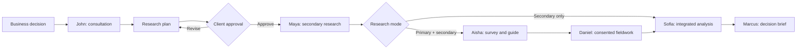

# Field & Signal

> **Market research that goes out and asks the market.**
> Meet the autonomous research team that investigates your business question, conducts fieldwork and delivers a decision-ready brief.

[Live application](https://fieldandsignal.vercel.app) · [Judge and AI-evaluator guide](./JUDGING_GUIDE.md) · [Sub-three-minute demo script](./DEMO_SCRIPT.md) · [MIT licence](./LICENSE)

Field & Signal is an AI-native market-research agency built for OpenAI Build Week. A client provides a business decision—not a research methodology—and six visible AI specialists frame the question, propose an approval-gated plan, gather public evidence, design and publish primary research, conduct consent-based interviews, integrate the evidence, and prepare a traceable strategic brief.

The core product thesis is simple: conventional AI research tools search what is already known; Field & Signal can also create a survey and go out and ask the market.

## Build Week eligibility and provenance

This repository and its implementation were created after 13 July 2026.

| Evidence | Timestamp | Source |
|---|---:|---|
| GitHub repository created | **15 Jul 2026, 22:48:30 UTC** / **16 Jul 2026, 06:48:30 SGT** | GitHub repository metadata |
| First commit | **16 Jul 2026, 06:55:09 SGT** | `8e57edb` — “Initial Field & Signal application” |
| Current implementation period | **16–20 Jul 2026** | 42 implementation commits preceded this documentation update |

Product ideation began in a separate ChatGPT conversation, while the application architecture, implementation, testing, iteration, Git workflow, and deployment were completed in Codex during the Build Week submission period. The repository history provides a dated record of this work through focused feature branches and pull requests.

The repository is public at [github.com/MT7654/fieldandsignal](https://github.com/MT7654/fieldandsignal) and is distributed under the [MIT licence](./LICENSE).

**Codex Session ID:** `019f6626-14cb-7613-acb5-08572294e743`

This is the Codex task in which the core application was built and iterated. Use this exact ID in the Devpost `/feedback` field; it is distinct from the earlier ChatGPT ideation-conversation ID.

## Why this project is different

Field & Signal is not a wrapper that asks several personas to comment on the same prompt. The agents own bounded stages of an operational research engagement and pass persisted, structured outputs forward:

1. The client states a decision and chooses secondary-only or primary-plus-secondary research.
2. John asks answerable clarification questions and turns unknowns into research tasks.
3. The client reviews, revises, and explicitly approves the research plan.
4. Maya performs live web discovery, inspects candidate pages, stores retained sources, and synthesizes only supplied evidence.
5. Aisha generates a five-question survey and five-question interview guide from the approved plan.
6. The client approves publication and the interview guide.
7. Real respondents can use hosted, anonymous survey links; consented participants can use hosted AI-interview links.
8. Sofia calculates survey bases in code and integrates sources, live responses, and completed transcripts.
9. Marcus creates a versioned brief linked to the evidence snapshot.

The user buys a research outcome, while approval gates preserve client control over methodology, publication, interviews, and future spending.

## The autonomous research team

Every specialist has a distinct role, prompt boundary, input contract, output schema, UI identity, and handoff.

| Agent | Role | Executes | Handoff |
|---|---|---|---|
| **John Lim** | AI Research Director | Clarification, plan creation, plan revision, cost and limitation framing | Approved plan to Maya and Aisha |
| **Maya Chen** | AI Secondary Research Analyst | Search-query construction, OpenAI web search, deterministic page extraction, relevance review, source-bounded synthesis | Sources and gaps to Sofia/Aisha |
| **Aisha Rahman** | AI Research Methodologist | Five-question survey, five-question interview guide, rationales and sampling guardrails | Approved instruments to Daniel |
| **Daniel Wong** | AI-assisted Interviewer | Consent, one-question-at-a-time interviews, adaptive probes, transcription, stop/skip handling | Completed transcript to Sofia |
| **Sofia Tan** | AI Insights Analyst | Code-calculated survey bases, cross-evidence analysis, confidence and limitations | Persisted findings to Marcus |
| **Marcus Lee** | AI Strategy Consultant | Recommendation, risks, change conditions, next actions and evidence-linked brief | Decision-ready brief to client |

The portraits are synthetic and every specialist is visibly labelled as an AI agent. The human-like agency presentation is a product metaphor, not an attempt to represent fictional people as employees.

## End-to-end product flow



### Approval and honesty boundaries

- Research does not start before plan approval.
- Survey publication requires a deliberate client action.
- Research interviews require an approved guide and participant consent.
- The interviewer discloses its AI identity and transcription behavior.
- Participants can skip, pause, correct, or stop.
- Synthetic survey results are clearly labelled and used only when no live response exists.
- The system never synthesizes fictional interview transcripts.
- Major findings carry evidence IDs and methodological limitations.
- Demo engagement content is visually distinguished from live research.

## Functional implementation matrix

| Capability | Live implementation | Demo behavior |
|---|---|---|
| Business intake | Browser state feeds server-side consultation and planning | Example copy is available for a fast walkthrough |
| Clarifying questions | GPT‑5.6 structured generation | Same UI with seeded sample where applicable |
| Plan and revisions | GPT‑5.6 + Zod; versions and approvals persisted | Complete Northstar sample |
| Secondary research | OpenAI web search, safe-URL filtering, page extraction, Supabase sources, one compact synthesis call | Sample evidence library on Northstar route |
| Survey design | GPT‑5.6 generates exactly five questions with rationales | Seeded five-question instrument |
| Survey publication | Hosted `/survey/[publicToken]`; responses and answers stored in Supabase | Sample public route remains navigable |
| Interviews | Hosted `/interview/[publicToken]`; consent, adaptive questions, transcript persistence, optional browser audio transcription | Practice interview is excluded from evidence |
| Analysis | Survey aggregation in code; GPT‑5.6 integrates bounded evidence; findings persisted | Synthetic survey preview is explicitly labelled if no live response exists |
| Brief | GPT‑5.6 creates a versioned brief from persisted findings | Complete sample brief |
| Progress UX | Honest indeterminate stages with elapsed time; no fabricated completion percentage for model work | Same visible agent experience |

## GPT‑5.6 usage

`OPENAI_MODEL` is configurable and the Build Week deployment uses GPT‑5.6 through the official OpenAI JavaScript SDK and Responses API. All calls happen server-side.

GPT‑5.6 performs:

- John’s clarification questions;
- initial and revised structured research plans;
- Maya’s focused public-source discovery through the Responses API web-search tool;
- Maya’s compact, source-bounded synthesis;
- Aisha’s survey and interview-guide generation;
- Daniel’s adaptive interview turns and end-of-interview summary;
- Sofia’s integrated evidence analysis; and
- Marcus’s strategic brief.

The shared inference adapter is [`lib/inference.ts`](./lib/inference.ts). It:

- selects OpenAI when `OPENAI_API_KEY` is configured;
- sends low-effort, server-side Responses API requests;
- disables response storage with `store: false`;
- asks for JSON objects;
- validates every structured result with Zod;
- retries malformed output with a targeted correction; and
- falls back to the optional Hugging Face route only when OpenAI is not configured.

Role-specific prompts live in [`lib/agents.ts`](./lib/agents.ts), while schemas and normalization live in [`lib/schemas.ts`](./lib/schemas.ts). Model output is never inserted directly into the database without schema validation.

### Token and latency discipline

- Reasoning effort is set to `low` for application operations.
- Survey and interview instruments are capped at five questions each.
- Maya is capped at three focused searches, twelve inspected pages, and six retained sources.
- OpenAI source discovery requests only two to four candidates per workstream query.
- Page extraction and survey aggregation are deterministic and do not consume model tokens.
- Maya receives one compact synthesis call after retrieval.
- Agents receive the evidence required for their task instead of the entire application history.

## How Codex and the builder collaborated

The collaboration was iterative rather than a single “build this app” prompt. The builder supplied the product vision, business logic, research-agency expectations, test scenarios, visual critique, and priorities. Codex translated those decisions into working software, verified each iteration, and maintained the deployment workflow.

### Decisions made by the builder

- Positioned the product as an AI-native market-research agency rather than a generic evidence checker.
- Chose **Field & Signal** and the final tagline.
- Required a visible, human-like team whose members remain clearly disclosed as AI agents.
- Chose the Singapore café-location scenario for live stress testing.
- Required clients to choose secondary-only or primary-plus-secondary research.
- Reframed John’s consultation questions so ordinary clients can answer them or say “I don’t know.”
- Required transparent research-plan costs, rationale for each workstream, and repeatable revision requests.
- Decided that browser-hosted surveys and consent-based assisted interviews were the credible hackathon scope.
- Required actual survey responses to replace synthetic preview data automatically.
- Required evidence confidence definitions, claim traceability, readable typography, mobile responsiveness, and visible long-running progress.
- Reduced Maya’s evidence ceiling only after relevance and downstream compatibility were working.

### Where Codex accelerated the workflow

- Converted a long product brief into a coherent Next.js route architecture and domain model.
- Built and repeatedly refined the editorial consultancy design system, responsive layouts, local agent portraits, and accessible interaction states.
- Created Supabase migrations, token-scoped research sessions, public survey/interview APIs, and server-only data access.
- Implemented the OpenAI Responses API adapter, role prompts, Zod contracts, output normalization, and guarded retries.
- Diagnosed real model-output failures, including malformed JSON and array-versus-string schema mismatches.
- Implemented the restartable Maya research state machine, URL-safety checks, source relevance scoring, extraction fallback, and source-bounded synthesis.
- Turned survey, interview, analysis, and brief screens from static demonstrations into persisted workflows.
- Added elapsed, staged progress interfaces for every model-backed operation so slow calls do not appear frozen.
- Reviewed screenshots supplied by the builder and corrected spacing, hierarchy, typography, avatar cropping, badge sizing, contrast, and mobile overflow.
- Added and maintained automated tests, type checks, linting, production builds, Git branches, pull requests, merges, and Vercel deployments.
- Helped audit credential handling without displaying secret values.

### Representative iteration history

The Git history makes the collaboration inspectable. Examples include:

- accessible application color and typography system;
- uncertainty-friendly consultation;
- plan approval, cost breakdowns, revisions, and structured-output recovery;
- live secondary research and relevance improvements;
- OpenAI GPT‑5.6 and web-search migration;
- source-confidence explanations;
- functional fieldwork, analysis, and briefs;
- mobile overflow and agent-heading fixes;
- five-question demo caps;
- hosted public fieldwork URLs;
- consistent progress states; and
- faster, coverage-aware Maya research.

Codex did not choose the product strategy autonomously. The builder continuously reviewed the product from the perspective of a market-research client and made the consequential product and methodology decisions; Codex made those decisions executable, testable, and deployable.

## Technical architecture

### Stack

- Next.js 15 App Router
- React 19
- strict TypeScript
- OpenAI JavaScript SDK and Responses API
- GPT‑5.6, configured through `OPENAI_MODEL`
- Supabase PostgreSQL and Data API
- Zod structured-output validation
- Cheerio deterministic HTML extraction
- Recharts
- Lucide icons
- Vitest and ESLint
- Vercel

### Runtime layers

```text
Browser UI
  ├─ Client engagement routes
  ├─ Public survey route
  └─ Public interview route
        ↓ validated HTTP requests
Next.js server routes
  ├─ research-session cookie validation
  ├─ Zod request/output validation
  ├─ OpenAI Responses API
  ├─ web discovery + deterministic extraction
  └─ Supabase server client
        ↓
Supabase PostgreSQL
  ├─ projects, plans and tasks
  ├─ sources
  ├─ surveys, responses and answers
  ├─ interviews and messages
  └─ findings and versioned briefs
```

### Important code entry points

| Concern | Files |
|---|---|
| Environment and provider selection | `lib/env.ts`, `lib/inference.ts`, `lib/huggingface.ts` |
| Agent roles and plan/brief prompts | `lib/agents.ts` |
| Structured contracts | `lib/schemas.ts` |
| Research-session authorization | `lib/research-session.ts` |
| Secondary-research state machine | `lib/secondary-research-server.ts`, `lib/secondary-research-types.ts` |
| Web discovery and extraction | `lib/openai-web-search.ts`, `lib/oxylabs.ts`, `lib/research-web-utils.ts` |
| Primary-research context | `lib/fieldwork.ts` |
| Survey generation and publication | `app/api/fieldwork/generate/route.ts`, `app/api/fieldwork/publish/route.ts` |
| Public survey | `app/survey/[publicToken]`, `app/api/survey-responses/route.ts` |
| Public interview | `app/interview/[publicToken]`, `app/api/interview-*` |
| Integrated analysis | `app/api/analysis/route.ts` |
| Decision brief | `app/api/brief/route.ts` |
| Database | `supabase/migrations`, `supabase/seed.sql` |
| Tests | `tests/` |

For a deterministic evaluator checklist and route-by-route inspection path, see [`JUDGING_GUIDE.md`](./JUDGING_GUIDE.md).

## Data model and security

The Supabase schema includes projects, clarifying questions, versioned plans, agent tasks, sources, surveys, questions, responses, answers, interview participants, interviews, messages, findings, briefs, and agent activity.

Key controls:

- Server-only credentials never enter client bundles.
- `.env.local` is ignored by Git.
- Live engagement access uses a high-entropy token stored in a scoped HTTP-only research-session cookie; only its SHA-256 hash is persisted in task state.
- Public survey and interview routes resolve only the record matching the supplied public token.
- Public writes pass through validated server routes.
- No anonymous table policy exposes participant identities, answers, transcripts, or private projects.
- Owner-oriented RLS policies are included for future authenticated multi-user operation.
- OpenAI response storage is disabled.
- URL fetches reject local and private network targets.
- Participant raw audio is not retained by default.

The hackathon demo intentionally removes sign-in friction. This does not mean the database is public: live client workflow access is scoped by the research-session cookie, and public participation is scoped by individual survey/interview tokens.

## Quick start

### Prerequisites

- Node.js 20+
- npm
- A Supabase project for persistent live research
- An OpenAI API key with access to the configured GPT‑5.6 model

### Install and run

```bash
git clone https://github.com/MT7654/fieldandsignal.git
cd fieldandsignal
npm install
cp .env.example .env.local
npm run dev
```

On PowerShell, replace the copy command with:

```powershell
Copy-Item .env.example .env.local
```

Open `http://localhost:3000`.

### Environment variables

| Variable | Required | Purpose |
|---|---:|---|
| `OPENAI_API_KEY` | For live GPT‑5.6 | Server-only OpenAI credential |
| `OPENAI_MODEL` | Recommended | GPT‑5.6 model identifier used by the deployment |
| `OPENAI_TRANSCRIBE_MODEL` | Optional | Browser-audio transcription model |
| `NEXT_PUBLIC_SUPABASE_URL` | For persistence | Public Supabase project URL |
| `SUPABASE_SECRET_KEY` | For persistence | Server-only Supabase secret key; never expose to the browser |
| `OXYLABS_USERNAME` | Optional fallback | Proxy username for page retrieval fallback |
| `OXYLABS_PASSWORD` | Optional fallback | Proxy password |
| `OXYLABS_PROXY_URL` | Optional fallback | Proxy endpoint |
| `HF_TOKEN` | Optional fallback | Hugging Face inference token used only when OpenAI is absent |
| `HF_MODEL` | Optional fallback | Hugging Face model identifier |
| `NEXT_PUBLIC_APP_URL` | Production | Canonical public origin used for hosted participant links |

The application runtime does not need a direct PostgreSQL password. Supabase migrations can be applied through the Dashboard SQL Editor, which is also useful when the free-plan database hostname is IPv6-only.

### Configure Supabase

1. Create a Supabase project.
2. Run `supabase/migrations/001_initial_schema.sql` in the SQL Editor.
3. Run `supabase/migrations/002_functional_fieldwork.sql`.
4. Run `supabase/seed.sql` to seed the six agents and sample public records.
5. Add `NEXT_PUBLIC_SUPABASE_URL` and `SUPABASE_SECRET_KEY` to `.env.local` and Vercel.
6. Optionally run `npm run supabase:check` and `npm run supabase:seed` in a network environment that can reach the project.

## Judge walkthrough

### Fast visual path

1. Open the [landing page](https://fieldandsignal.vercel.app).
2. Select **View sample engagement** to inspect the full Northstar Cinemas story without spending model tokens.
3. Review Plan → Evidence → Survey → Interviews → Analysis → Brief.
4. Confirm that agent identities, demo disclosures, confidence labels, evidence IDs, and limitations remain visible.

### Live functional path

1. Select **Start a research engagement**.
2. Choose **Primary + secondary research**.
3. Use the Singapore specialty-coffee test case in `JUDGING_GUIDE.md`.
4. Answer John’s questions; “I don’t know” is accepted and becomes an evidence gap.
5. Review or revise the plan, then approve it.
6. Let Maya retrieve real sources.
7. Ask Aisha to create and publish the five-question survey.
8. Open the hosted survey link in a private window and submit a real response.
9. Approve Daniel’s guide and run a practice or research interview.
10. Ask Sofia to refresh the analysis.
11. Open Marcus’s automatically generated brief.

Model-backed stages can take time. The UI shows elapsed, indeterminate, stage-specific progress rather than inventing a percentage that the provider cannot know.

## Verification

```bash
npm run typecheck
npm run lint
npm test
npm run build
```

Expected current result:

- strict TypeScript passes;
- ESLint passes with zero warnings;
- **33 tests** pass across 10 test files; and
- Next.js produces all application and API routes successfully.

The tests cover schema normalization and caps, consultation prompt behavior, Hugging Face JSON recovery fallback, public URL construction, URL-safety/relevance utilities, research limits, and staged progress-state logic.

## Known limitations and non-claims

- Field & Signal does not autonomously cold-call or mass-message people.
- Respondent recruitment is bring-your-own-audience for this hackathon build.
- The public survey is intentionally compact rather than a full Typeform replacement.
- Analysis uses a clearly labelled synthetic survey preview only when zero live responses exist; once a live response exists, only actual survey submissions are analyzed.
- Practice interviews are excluded from research evidence.
- Small, convenience samples cannot establish population-level demand.
- Secondary sources can inform a decision but do not replace site-level commercial due diligence.
- PDF export uses the browser’s print-to-PDF path.
- The sample engagement is illustrative and must not be treated as investment advice or a real commissioned study.
- Production-scale authentication, organizations, billing, respondent panels, quotas, incentives, and human researcher review remain future work.

## Deployment

1. Import this repository into Vercel.
2. Add the environment variables for Production, Preview, and Development as appropriate.
3. Apply the Supabase migrations before testing a live engagement.
4. Set `NEXT_PUBLIC_APP_URL` to the production origin.
5. Redeploy whenever environment variables are rotated; existing deployments keep the values with which they were built.
6. Verify with `npm run build` before promotion.

Production: [fieldandsignal.vercel.app](https://fieldandsignal.vercel.app)

## Licence

Copyright © 2026 Field & Signal contributors. Released under the [MIT License](./LICENSE).
